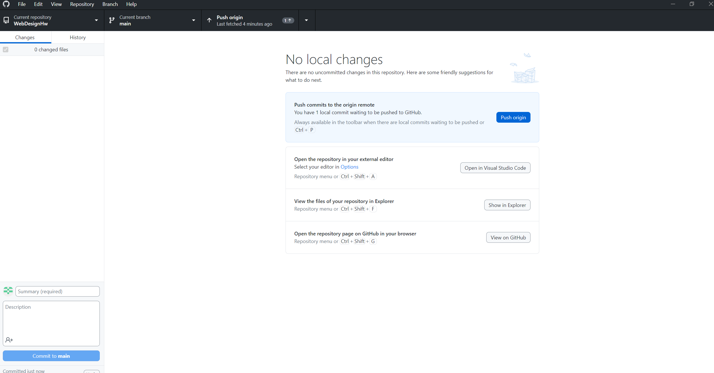

## This is my assignment 5
https://corymckague.github.io/WebDesignHw/Assignment5/
This page will show examples of some new things I have learned in html. I will show examples of using different paragraphs, page breaks and links! A major part of this section is me using Github Desktop. Here is a screenshot of it: 

